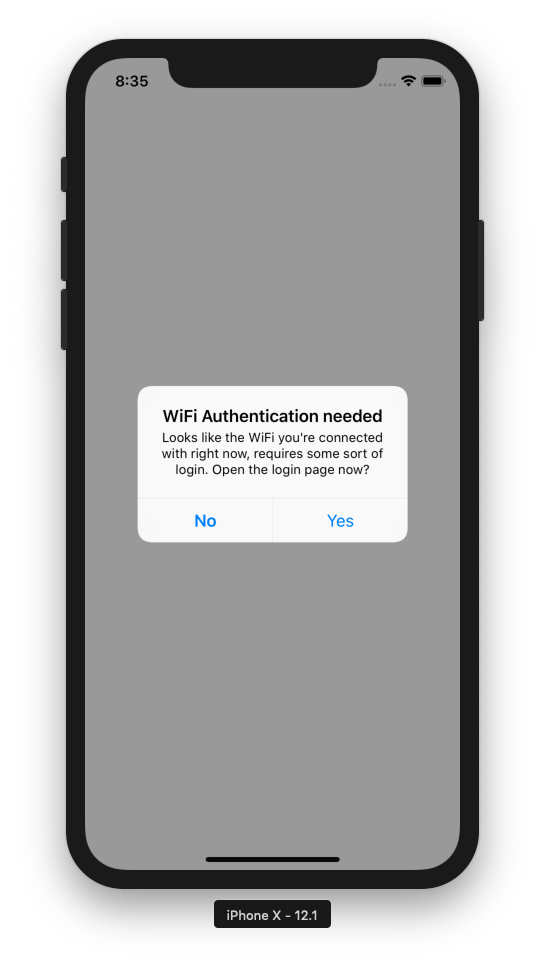

# WiFiAuth



> Because connecting to WiFI networks is still an unsolved problem

Checking if a WiFi network needs the user to login on some kind of login page is the responsibility of the operating system. However iOS is still having a hard time detecting most WiFis, resulting in apps to not work. Unless you know you have to open Safari and access a non-SSL encrypted website like http://neverssl.com, the user is confused, and doesn't know why your app is "broken".

The only app I've ever seen do this right is Facebook Messenger: They show a banner on top of the message list, letting you know the currently connected network needs some kind of user-interaction. Tapping that banner would open up an in-app browser.

This project is just a proof of concept I hacked together in less than an hour. 

However I do believe it might be worth finishing that SDK and make it production ready. 

Turns out, WiFi auth flows are very complicated. However from an app's perspective, sending an unencrypted GET request, and checking if there is a redirect to a login page should be enough to see if your app has access to the internet.

<a href="https://developer.apple.com/library/archive/documentation/NetworkingInternet/Conceptual/Hotspot_Network_Subsystem_Guide/Contents/AuthStateMachine.html#//apple_ref/doc/uid/TP40016639-CH2-SW1">
  
</a>

The current implementation uses code from [Reachability](https://github.com/tonymillion/Reachability), using `<SystemConfiguration/SystemConfiguration.h>`

```objective-c
SCNetworkReachabilityRef reachabilityRef = SCNetworkReachabilityCreateWithAddress(kCFAllocatorDefault, (const struct sockaddr*)hostAddress);

if (SCNetworkReachabilityGetFlags(reachabilityRef, &flags))
{
    return ((flags & kSCNetworkReachabilityFlagsConnectionRequired) &&
            (flags & kSCNetworkReachabilityFlagsInterventionRequired));
}

return NO;
```
